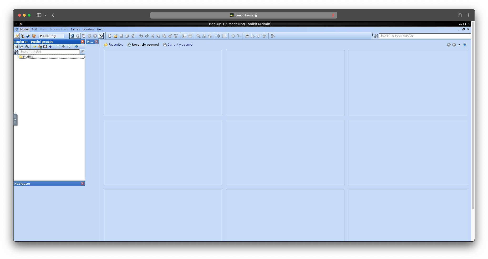

# Bee-Up via Docker

> Bee-Up is an ADOxx-based hybrid modelling tool, encompassing five different modelling languages:
> * BPMN - Business Process Model and Notation
> * EPC - Event-driven Process Chains
> * ER - Entity Relationship Diagrams
> * UML - Unified Modeling Language
> * Petri Nets

_&#8213; https://bee-up.omilab.org/activities/bee-up/_

## Intro
This repository serves as an alternative installation approach for Bee-Up. Whenever you need to use Bee-Up you can 
simply open your browser and visit `https://localhost:8080/vnc.html`.

## Installation
1) Clone this repository
2) Open a terminal and run `bash install.sh` in the repository root
    - On Windows you can use the `install.ps1` script with PowerShell
3) Follow the instructions in the terminal

## Uninstallation
1) Open a terminal and run `bash uninstall.sh` in the repository root
    - On Windows you can use the `uninstall.ps1` script with PowerShell

## Notes
This was last tested with the Bee-Up 1.6 release for macOS (`sha1sum: 7e323785a46c0a438144abf1b19cb19d43d64fea`)
on Fedora 34 64-bit and MacOS 12.2.1 M1.

## Contributors

