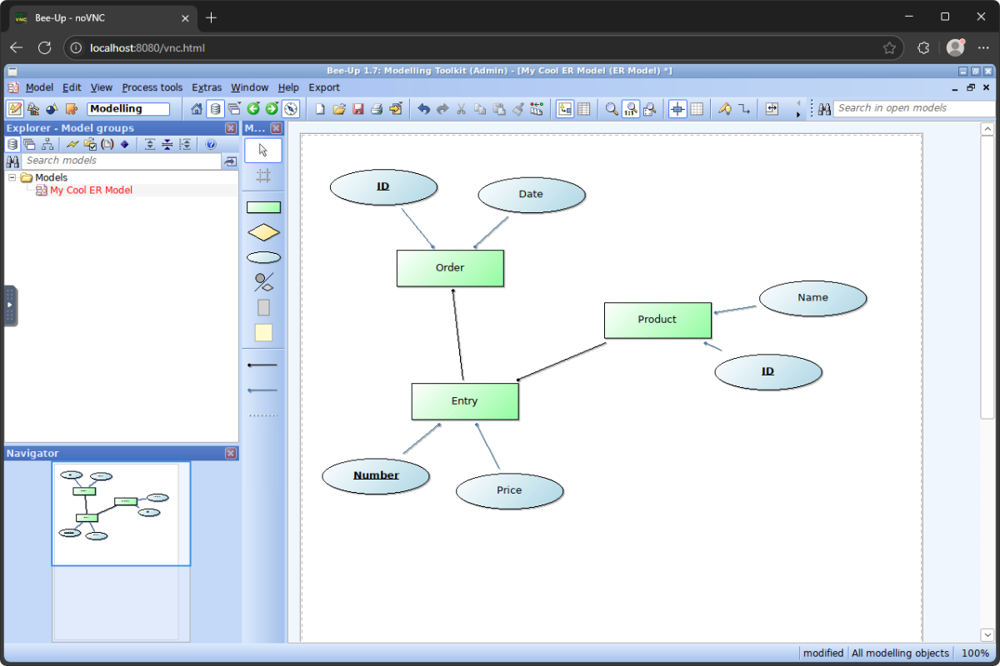

# Bee-Up via Docker

[](https://github.com/realk1ko/beeup-docker/blob/master/LICENSE)

> Bee-Up is an ADOxx-based hybrid modelling tool, encompassing five different modelling languages:
> * BPMN - Business Process Model and Notation
> * EPC - Event-driven Process Chains
> * ER - Entity Relationship Diagrams
> * UML - Unified Modeling Language
> * Petri Nets

_&#8213; https://bee-up.omilab.org/activities/bee-up/_

## About
This repository serves as an alternative installation approach for Bee-Up to simplify the already complicated 
installation process. Instead of a native application, you use your browser to create some fancy diagrams for your
modelling class in university.

## Usage

### Quick Start

To get started with an automated installation, do the following:
1) [Clone this repository](https://docs.github.com/en/get-started/getting-started-with-git/about-remote-repositories#cloning-with-https-urls):
2) Then, run the installation script:
   - **Linux/MacOS:** Open a terminal inside the repository folder and run `bash install.sh`
   - **Windows:** Open a PowerShell inside the repository folder and run `install.ps1`
3) Follow the instructions printed by the script
4) Afterwards refer to [Notes on Usage](#notes-on-usage) for some tips

If you wish to remove the components installed by the script, do the following:
- **Linux/MacOS:** Open a terminal inside the repository folder and run `bash uninstall.sh`
- **Windows:** Open a PowerShell inside the repository folder and run `uninstall.ps1`

### Manual Setup

The following tags are published to the GitHub Container Registry:

- The `latest` tag refers to the latest stable image tested with Docker
- The `latest-arm64-emulation` refers to to the latest stable `amd64` image that works when run in an emulation
  environment on `arm64`

Additionally each published image is tagged with the installed Bee-Up version. Refer to the packages
overview [here](https://github.com/users/realk1ko/packages/container/package/beeup-docker) for more info.

The container's HTTP port defaults to `8080`.

Within the running container the following directories might be of interest for a manual setup:

| Directory               | Description                                                                           |
|-------------------------|---------------------------------------------------------------------------------------|
| `/opt/mssql/adoxx_data` | Contains the database files created by ADOxx                                          |
| `/var/opt/mssql`        | Contains the database files created by MSSQL (for instance for users and permissions) |
| `/home/app/PDF`         | Is the directory the PDF printing function will save the files to                     |

The following environment variables can be used for configuration:

| Variable               | Description                                                                                                                                                                                                                                                |
|------------------------|------------------------------------------------------------------------------------------------------------------------------------------------------------------------------------------------------------------------------------------------------------|
| `DATABASE_HOST`        | The database host that Bee-Up will connect to; If this value is `127.0.0.1` the integrated MSSQL instance will be started in the container, otherwise MSSQL will not start                                                                                 |
| `DATABASE_PASSWORD`    | The database super admin (SA) password to use                                                                                                                                                                                                              |
| `DATABASE_NAME`        | The name of the database object Bee-Up will use                                                                                                                                                                                                            |
| `DATABASE_ACCEPT_EULA` | When you're using the integrated MSSQL database (`DATABASE_HOST=127.0.0.1`), you need to accept the end user license agreement between Microsoft and you (`DATABASE_ACCEPT_EULA=y`); Refer to https://go.microsoft.com/fwlink/?LinkId=746388 for more info |
| `ADOXX_LICENSE_KEY`    | The license key to activate/install ADOxx                                                                                                                                                                                                                  |

The following run command can be used as an guide for a manual setup:
```
sudo docker run --name beeup \
    --restart unless-stopped \
    -d \
    -p 8080:8080 \
    -v beeup-db-adoxx:/opt/mssql/adoxx_data \
    -v beeup-db-mssql:/var/opt/mssql \
    -v "$(pwd)/pdfs":/home/app/PDF \
    -e DATABASE_HOST=127.0.0.1 \
    -e DATABASE_PASSWORD='supersecret' \
    -e DATABASE_NAME=beeup_64 \
    -e DATABASE_ACCEPT_EULA=y \
    -e ADOXX_LICENSE_KEY=494fe189-0931-4648-bde4-156f452dea2a \
    ghcr.io/realk1ko/beeup-docker:latest
```

### Notes on Usage
- Turn on remote resizing for the best user experience. Click on the gear icon (options) on the left hand side and
  change the scaling mode.
- The bundled standard attribute profiles (`*.adl`) can be found in the home directory of the user inside the container.
- The installation script sets up a directory within the repository folder (`./pdfs`) into which the PDF printed models
  are exported.
